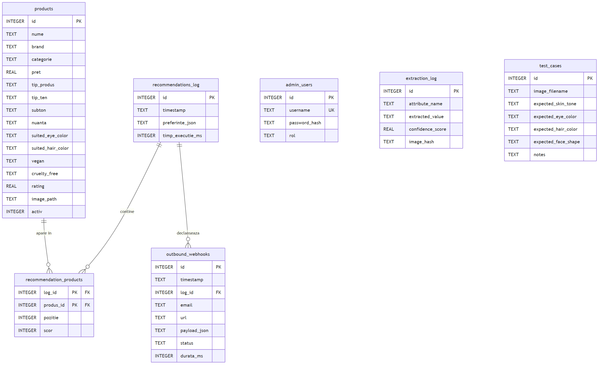
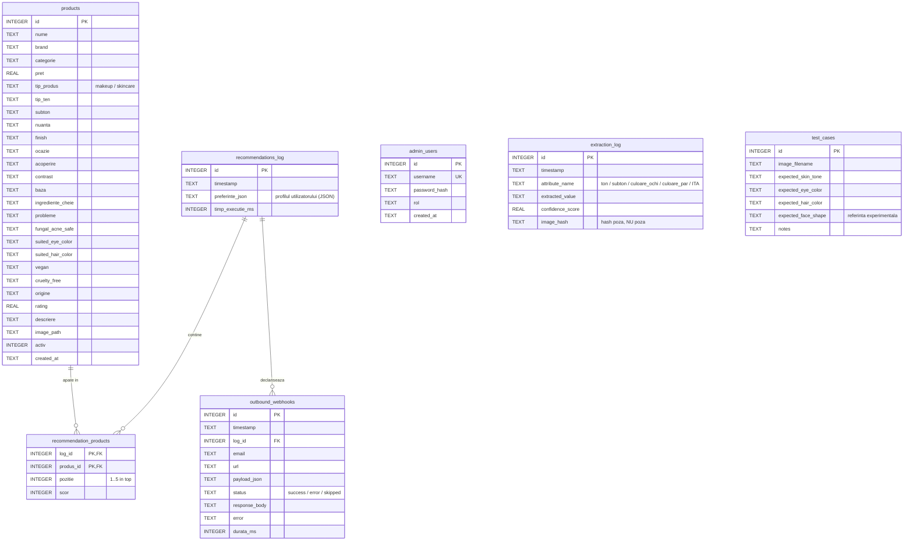

# Schema bazei de date (GlowMatch)

Baza de date e **SQLite** (`data/app.db`), construita din CSV cu `seed_db.py`.
Schema completa e definita in [db.py](db.py#L26-L114). Mai jos ai:
1. diagrama entitate-relatie (ER) — vizuala;
2. aceeasi diagrama in ASCII (pentru lucrare/print);
3. descrierea fiecarui tabel, coloana cu coloana;
4. relatiile dintre tabele explicate.

---

## 1. Diagrama ER (Mermaid)

> Imagine gata de pus in lucrare: [docs/diagrame/schema_bd.png](docs/diagrame/schema_bd.png)



> Codul Mermaid de mai jos se vede randat in VSCode (cu extensia Markdown Preview
> Mermaid) si direct pe GitHub — il poti edita oricand si regenera imaginea.



`admin_users`, `extraction_log` si `test_cases` nu au chei straine — sunt tabele
independente (autentificare, audit analiza foto, respectiv ground truth pentru evaluare).

---

## 2. Diagrama ER (ASCII — pentru lucrare/print)

```
                          ┌───────────────────────────┐
                          │       recommendations_log  │
                          │───────────────────────────│
                          │ PK id                      │
                          │    timestamp               │
                          │    preferinte_json (JSON)  │
                          │    timp_executie_ms        │
                          └─────────────┬──────────────┘
                                        │ 1
                          ┌─────────────┴──────────────┐
                          │                             │
                        N │                           N │
        ┌─────────────────┴───────────┐   ┌─────────────┴──────────────┐
        │   recommendation_products    │   │      outbound_webhooks      │
        │──────────────────────────────│   │─────────────────────────────│
        │ PK,FK log_id   ───────────────┘   │ PK   id                     │
        │ PK,FK produs_id ──┐               │ FK   log_id (SET NULL)      │
        │       pozitie     │               │      email / url            │
        │       scor        │               │      payload_json           │
        └───────────────────┼───────────────│      status / error         │
                          N  │               │      durata_ms              │
                             │ 1             └─────────────────────────────┘
                ┌────────────┴───────────────┐
                │          products           │
                │─────────────────────────────│
                │ PK id                       │
                │    nume / brand / categorie │
                │    pret / rating            │
                │    tip_produs (makeup/skin) │
                │    tip_ten/subton/nuanta... │
                │    suited_eye/hair_color    │
                │    vegan / cruelty_free     │
                │    activ                    │
                └─────────────────────────────┘


   Tabele independente (fara chei straine):

   ┌──────────────────┐   ┌───────────────────────┐   ┌──────────────────────────┐
   │   admin_users    │   │    extraction_log     │   │       test_cases         │
   │──────────────────│   │───────────────────────│   │──────────────────────────│
   │ PK id            │   │ PK id                 │   │ PK id                    │
   │    username (UK) │   │    attribute_name     │   │    image_filename        │
   │    password_hash │   │    extracted_value    │   │    expected_skin_tone    │
   │    rol           │   │    confidence_score   │   │    expected_eye_color    │
   └──────────────────┘   │    image_hash         │   │    expected_hair_color   │
                          └───────────────────────┘   │    expected_face_shape   │
                                                       │    notes                 │
                                                       └──────────────────────────┘

   Legenda:  PK = cheie primara   FK = cheie straina   UK = unic
             1 ── N = relatie unu-la-multi
```

---

## 3. Tabelele, pe rand

### `products` — catalogul de produse
Inima catalogului. Fiecare rand = un produs (makeup sau skincare).

| Coloana | Tip | Rol |
|---|---|---|
| `id` | INTEGER PK | identificator unic |
| `nume`, `brand`, `categorie` | TEXT | identitatea produsului |
| `pret` | REAL | pret (>= 0) |
| `tip_produs` | TEXT | `makeup` sau `skincare` — separa cele 2 formulare |
| `tip_ten`, `subton`, `nuanta` | TEXT | potrivire pe profilul tenului |
| `finish`, `ocazie`, `acoperire`, `contrast`, `baza` | TEXT | criterii estetice makeup |
| `ingrediente_cheie`, `probleme`, `fungal_acne_safe` | TEXT | criterii skincare |
| `suited_eye_color`, `suited_hair_color` | TEXT | potrivire pe ochi/par (din analiza foto) |
| `vegan`, `cruelty_free` | TEXT | `Da` / `Nu` — filtre etice |
| `origine` | TEXT | tara/regiune |
| `rating` | REAL | nota (0–5); 4.0 = valoare implicita |
| `descriere`, `image_path` | TEXT | text + calea catre poza |
| `activ` | INTEGER | 1 = vizibil in recomandari, 0 = ascuns |
| `created_at` | TEXT | data adaugarii |

> Coloanele cu mai multe valori folosesc separatorul `|` (ex. `cald|neutru`), iar
> `toate` inseamna „universal, se potriveste cu orice".

### `recommendations_log` — istoricul recomandarilor
Cate un rand de fiecare data cand cineva cere recomandari. `preferinte_json` salveaza
profilul/optiunile alese (ca JSON), iar `timp_executie_ms` masoara performanta motorului.
Sta la baza tuturor rapoartelor din admin.

### `recommendation_products` — ce produse au fost recomandate (tabel de legatura)
Leaga `recommendations_log` de `products` (relatie multi-la-multi). Fiecare rand spune:
„in recomandarea X, produsul Y a fost pe pozitia `pozitie` cu scorul `scor`".
Cheia primara compusa `(log_id, produs_id)` impiedica duplicatele.

### `outbound_webhooks` — jurnalul apelurilor catre n8n
Inregistreaza fiecare incercare de trimitere a recomandarilor pe email prin n8n:
URL, payload, `status` (`success` / `error` / `skipped`), raspuns, eroare si durata.
Folosit de pagina admin `/webhooks`.

### `admin_users` — conturile de administrator
Login-ul in zona admin. Parola e stocata ca **hash** (PBKDF2), niciodata in clar.
`username` e unic.

### `extraction_log` — audit pentru analiza foto
Cate un rand per atribut extras dintr-o poza (ton, subton, culoare ochi/par, ITA).
**Nu pastreaza poza** — doar `image_hash` (SHA-256), pentru a respecta GDPR si a putea
totusi grupa atributele aceleiasi analize.

### `test_cases` — ground truth pentru evaluare
Pozele de test cu etichetele lor reale (notate manual, vizual). Folosit de scripturile
de evaluare ca sa masoare acuratetea analizei foto. `expected_face_shape` e pastrat doar
ca referinta experimentala (forma fetei a fost scoasa din productie — rezultat negativ).

---

## 4. Relatiile (chei straine) si ce se intampla la stergere

| De la | Catre | La stergerea parintelui |
|---|---|---|
| `recommendation_products.log_id` | `recommendations_log.id` | **CASCADE** — se sterg si randurile de produse |
| `recommendation_products.produs_id` | `products.id` | **CASCADE** — daca stergi un produs, dispare din istoric |
| `outbound_webhooks.log_id` | `recommendations_log.id` | **SET NULL** — webhook-ul ramane, dar pierde legatura |

> `PRAGMA foreign_keys = ON` e activat in [db.py](db.py#L18), deci aceste reguli chiar
> se aplica (SQLite le ignora implicit altfel).

### Indecsi (pentru viteza interogarilor din rapoarte)
- `idx_log_timestamp` pe `recommendations_log(timestamp)`
- `idx_recprod_produs` pe `recommendation_products(produs_id)`
- `idx_webhook_timestamp`, `idx_webhook_status` pe `outbound_webhooks`
- `idx_extraction_timestamp` pe `extraction_log(timestamp)`
