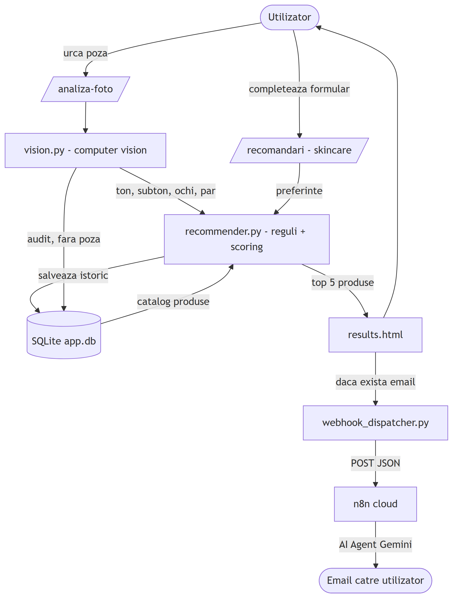
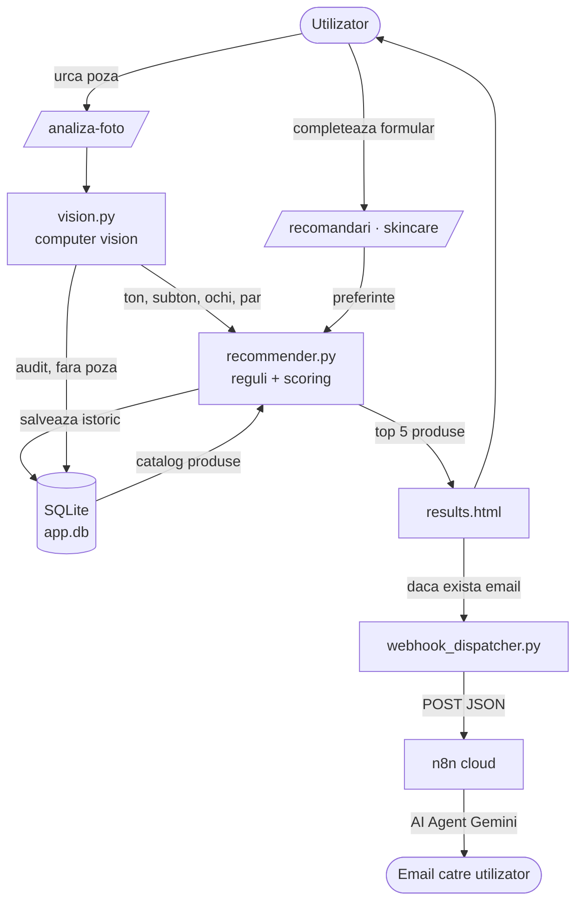
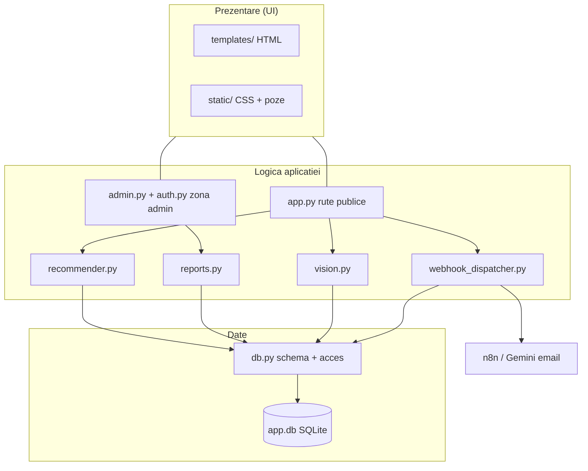
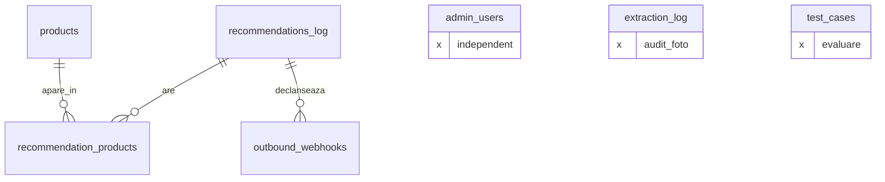

# Diagrame de prezentare (simplificate)

Diagrame „de slide" — fara coloane, doar ideea principala. Bune pentru
prezentarea de licenta, unde conteaza claritatea, nu detaliile.

---

## 1. Fluxul de date al aplicatiei (cum circula informatia)

> Imagine gata de pus in lucrare: [docs/diagrame/flux_date.png](docs/diagrame/flux_date.png)





### Varianta ASCII

```
   ┌─────────────┐
   │ Utilizator  │
   └──────┬──────┘
          │ urca poza / completeaza formular
          ▼
   ┌──────────────────────────────────────────┐
   │              app.py (Flask)               │
   └───┬───────────────────────┬───────────────┘
       │ poza                  │ preferinte
       ▼                       │
 ┌───────────┐                 │
 │ vision.py │ ton/subton/     │
 │  (CV+ITA°)│ ochi/par        │
 └─────┬─────┘                 │
       │                       ▼
       │              ┌────────────────┐      ┌──────────────┐
       └─────────────►│ recommender.py │◄─────│   app.db     │
                      │ reguli+scoring │      │  (catalog)   │
                      └───────┬────────┘      └──────────────┘
                              │ top 5 produse
                              ▼
                      ┌────────────────┐
                      │  results.html  │──► afisat utilizatorului
                      └───────┬────────┘
                              │ daca a dat email
                              ▼
                  ┌──────────────────────┐
                  │ webhook_dispatcher.py│──► n8n ──► AI (Gemini) ──► Email
                  └──────────────────────┘
```

---

## 2. Arhitectura pe straturi (ce piesa unde sta)



---

## 3. Schema BD simplificata (doar tabelele + relatiile)

Pentru cand vrei doar legaturile, fara lista de coloane.



### Varianta ASCII

```
   recommendations_log ──1──N── recommendation_products ──N──1── products
            │
            └──1──N── outbound_webhooks

   (independente, fara relatii)
   admin_users      extraction_log      test_cases
```
